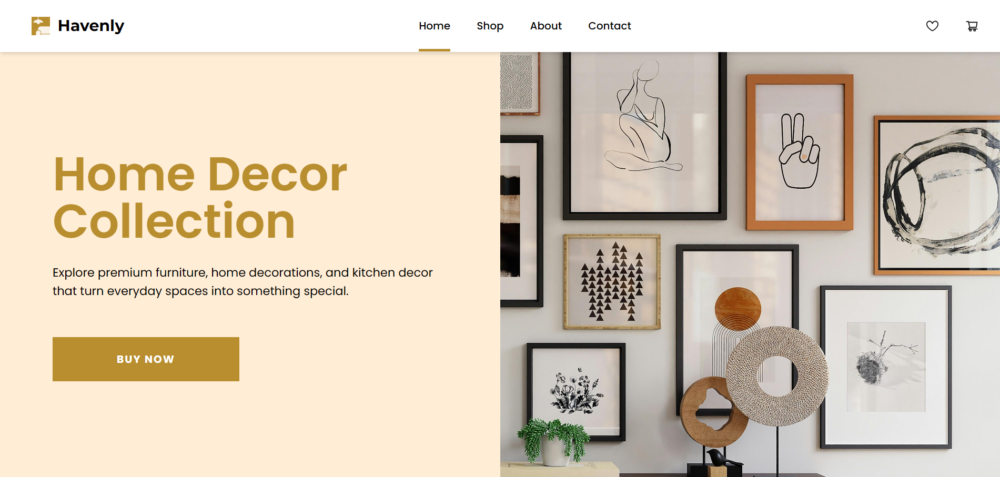

# Home Store Ecommerce App

[This]() is a modern e-commerce web application for home essentials including furniture, home décor, and kitchen accessories. Users can browse products, filter and sort them dynamically, compare items, manage their cart and wishlist, and view detailed product information.

## Table of contents

- [About](#about)
  - [Links](#links)
  - [Screenshots](#screenshots)
  - [Tech Stack](#tech-stack)
  - [Features](#features)
- [Author](#author)
- [Acknowledgments](#acknowledgments)

## About

### Links

- Solution URL: 
- Live Site URL: 

### Screenshot

### Tech Stack

- React
- JavaScript
- Redux
- React Router
- Tailwind CSS
- Vercel

### Features

- **Product Grid**
  Displays a responsive grid of products with images, pricing (including discounts), ratings, and brand information.

- **Advanced Filtering**
  Users can filter products using multiple criteria simultaneously:
  - Category
  - Brand
  - Price ranges

  Filtering supports multi-select options and dynamically updates the product list.

- **Product Search**
  Real-time search functionality allows users to find products by name or brand while respecting active filters.

- **Sort Options**
  Products can be sorted by:
  - Price (Low → High, High → Low)
  - Rating (Low → High, High → Low)

  Sorting integrates seamlessly with filtering and search.

- **Product Comparison Tool**
  Users can select up to multiple products and compare their key specifications. Designed for side-by-side evaluation before purchase decisions.

- **Shopping Cart**
  - Add / remove products
  - Quantity management
  - Persistent storage using LocalStorage
  - Dynamic price calculation

  Cart state is preserved across sessions.

- **Wishlist**
  Users can save products for later viewing. Wishlist items are also persisted using LocalStorage.

- **Product Details Page**
  Dedicated product page including:
  - Image gallery
  - Detailed specifications
  - Pricing breakdown
  - User reviews and ratings

- **Responsive UI**
  Fully responsive layout optimized for mobile, tablet, and desktop screens using Tailwind CSS.

## Author

- LinkedIn - [Sruthi V Nair](https://www.linkedin.com/in/sruthi-v-nair-5b5a09191/)
- Github - [Sruthi V Nair](https://github.com/sruthi-nair166)

## Acknowledgments

This project is built strictly for learning and portfolio purposes and is not intended for commercial use.

- **Product Data**
  Product information is adapted from the DummyJSON public API. ([DummyJSON](https://dummyjson.com/docs/products)). For this project, selected categories were extracted and stored locally in a static data.js file for demonstration purposes.

- **Image Assets**
  - Decorative and aesthetic images were sourced from Unsplash([Unsplash](https://unsplash.com/)).

  Some product images were gathered from publicly available online sources for educational and demonstration use only.

- This project was built as part of an assignment in the Full Stack Development course I'm currently enrolled in, offered by Entri Elevate. Special thanks to the course instructors and materials for the guidance and support.
